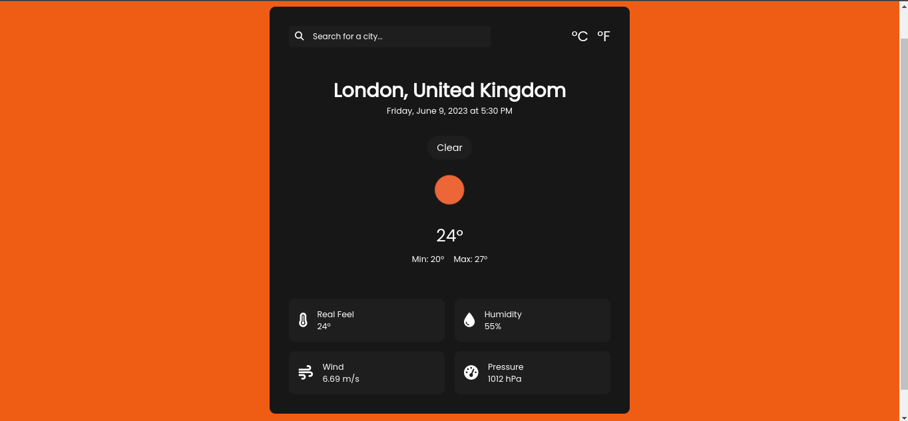

## Weather App

This is a simple weather application built using HTML5, CSS3, and JavaScript. It allows users to get weather information for a specific location by entering the name of a city or the ZIP code.

### Features

- Current weather conditions including temperature, humidity, wind speed...
- Five-day weather forecast displaying temperature and weather conditions.
- Responsive design that works well on different screen sizes.

### Screenshots

### Installation

To run the Weather App locally, follow these steps:

1. Clone the repository: `git clone https://github.com/igrbrasaic/weather-app.git`
2. Open the project directory: `cd weather-app`
3. Open `index.html` in your web browser.

### Usage

- Enter the name of a city or the ZIP code in the search bar.
- Press the Enter key or click the search button to retrieve the weather information.
- The current weather and five-day forecast will be displayed.

### Customization

If you want to modify the default behavior of the Weather App, you can make changes in the JavaScript code. Here are some key variables and functions you can modify:

- `currCity`: Represents the default city for which weather information is displayed. You can change it to any city of your choice.
- `units`: Specifies the unit of measurement for temperature. You can set it to `"metric"` for Celsius or `"imperial"` for Fahrenheit.
- `getWeather()`: This function fetches the weather data from the OpenWeatherMap API and updates the weather display. You can customize it to add additional weather information or modify the UI elements as per your requirements.

Feel free to explore the code and make any necessary changes to suit your preferences.

